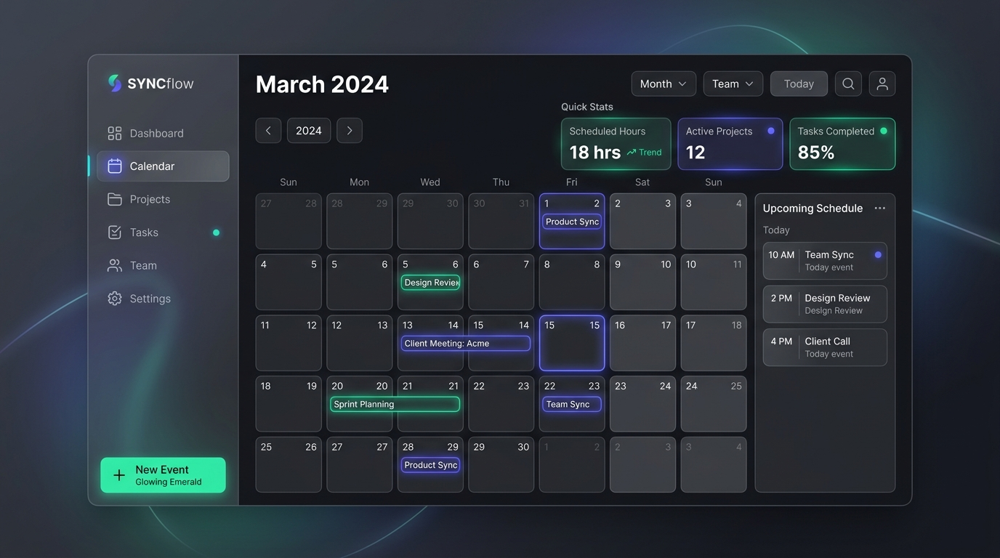

# 📅 PlanCraft PRO — Smart Scheduler with Supabase Cloud (v2.5)

Aplikasi Scheduling & Manajemen Agenda modern, rapih, elegan, responsif, dan **sangat mudah di-edit**. Dilengkapi dengan **Autentikasi & Database Supabase**, di mana setiap akun memiliki login/password tersendiri dan data jadwal tersimpan aman secara terisolasi per akun (*Row Level Security*).



---

## 🔐 Integrasi Supabase: Autentikasi & Isolasi Data Akun

Aplikasi ini telah terhubung ke **Supabase** dengan fitur:
- 👤 **Login & Registrasi Akun**: Mendaftar dan masuk menggunakan Email dan Kata Sandi resmi Supabase (`auth.users`).
- 🛡️ **Row Level Security (RLS)**: Setiap akun **hanya dapat melihat, menambah, mengubah, dan menghapus jadwal miliknya sendiri**. Data akun A tidak akan pernah tertukar dengan akun B!
- ☁️ **Cloud Real-time Persistence**: Jadwal dan catatan harian langsung tersimpan di database PostgreSQL Supabase di cloud.
- 📱 **Penyimpanan Multi-Akun**: Jika login dengan akun berbeda di perangkat yang sama, aplikasi otomatis memuat data jadwal milik akun yang baru masuk.
- 📴 **Mode Tamu (Offline Guest)**: Tetap dapat digunakan secara lokal saat belum login atau saat offline.

---

## ⚡ Langkah Mudah Menghubungkan Supabase Anda

Hanya butuh 3 langkah singkat:

### 1. Buat Project di Supabase
1. Buka [https://supabase.com](https://supabase.com) dan buat proyek baru (gratis).
2. Buka menu **Project Settings** -> **API**.
3. Salin **Project URL** dan **anon public key**.

### 2. Jalankan Schema Database di Supabase
1. Buka file [supabase-schema.sql](file:///c:/Users/Student/Documents/gameku/supabase-schema.sql) di folder proyek ini dan salin seluruh kodenya.
2. Di Dashboard Supabase Anda, buka tab **SQL Editor** -> klik **New query**.
3. Tempelkan (*paste*) kode SQL tersebut lalu klik tombol **Run**.
4. Tabel `schedules` dan `day_notes` beserta kebijakan keamanan Row Level Security (RLS) akan aktif otomatis!

### 3. Masukkan Kredensial di Aplikasi
1. Buka aplikasi di browser: **[http://localhost:3000](http://localhost:3000)**.
2. Klik tombol **Supabase** di sidebar atau badge status di kanan atas header.
3. Masukkan **Project URL** dan **Anon Key** Anda, lalu klik **Simpan & Hubungkan**.
4. Status akan berubah menjadi **🟢 Supabase Cloud**.
5. Klik **Masuk Akun** untuk mendaftar akun pertama Anda dengan Email & Password!

*(Kredensial juga dapat disimpan di file `.env` mengacu pada contoh [.env.example](file:///c:/Users/Student/Documents/gameku/.env.example)).*

---

## ✨ Fitur Lengkap Aplikasi

1. **Autentikasi & Profil Pengguna**:
   - Modal Login & Register dengan verifikasi password.
   - Profil pengguna menampilkan email, total jadwal di cloud, dan tombol sinkronisasi.
   - Tombol keluar (Logout) yang aman.

2. **5 Tampilan Kalender & Alur Kerja**:
   - 📅 **Kalender Bulanan (Month View)**: Grid 1 bulan penuh, penanda hari ini, chip kegiatan berkode warna, dan indikator overflow.
   - 📆 **Timeline Mingguan (Week View)**: Jadwal 7 hari dengan slot per jam (00:00 - 23:00) dan penanda garis waktu sekarang yang berpendar.
   - ⏰ **Harian Terfokus (Day View)**: Rincian kegiatan per jam, catatan harian (*Day Notes* auto-save), dan checklist target.
   - 📋 **Papan Status Kanban**: 4 kolom status (*Rencana*, *Sedang Berjalan*, *Terjadwal*, *Selesai*) dengan tombol cepat advance status.
   - 📝 **Daftar Agenda (Agenda View)**: Garis waktu kronologis terhubung (*Hari Ini*, *Besok*, *Mendatang*, *Riwayat*).

3. **Command Palette Pintar (<kbd>Ctrl</kbd> + <kbd>K</kbd> / <kbd>⌘</kbd> + <kbd>K</kbd>)**:
   - Navigasi instan bergaya Raycast & Linear.
   - Cari jadwal apa saja atau jalankan perintah sistem langsung dari keyboard.

4. **Focus Session (Pomodoro Timer)**:
   - Timer fokus 25 menit, 5 menit (rehat), dan 15 menit (santai).

5. **Efek Audio Sintesis & Selebrasi Confetti**:
   - Suara UI halus dan interaktif berbasis Web Audio API tanpa perlu file eksternal (bisa dimatikan/dihidupkan dengan 1-klik).
   - Efek ledakan confetti saat menyelesaikan tugas atau agenda.

6. **Kustomisasi & Ekspor/Impor**:
   - Kategori berkode warna dan bergradien kustom.
   - Ekspor data backup ke file `.json`.
   - Impor data dari file `.json` atau tempel teks.

7. **Shortcut Keyboard Lengkap**:
   - <kbd>Ctrl</kbd> + <kbd>K</kbd> : Buka Command Palette.
   - <kbd>N</kbd> : Buka modal tambah jadwal baru.
   - <kbd>T</kbd> : Lompat ke Hari Ini.
   - <kbd>1</kbd> - <kbd>5</kbd> : Ganti tampilan (Bulan, Minggu, Hari, Kanban, Agenda).
   - <kbd>Esc</kbd> : Tutup modal yang sedang terbuka.

---

## 🚀 Cara Menjalankan Server

```bash
npm start
# atau
node server.js
```
Akses di browser:
👉 **[http://localhost:3000](http://localhost:3000)**

---

## 📂 Struktur Berkas Terkait Supabase

- [supabase-client.js](file:///c:/Users/Student/Documents/gameku/supabase-client.js): Modul autentikasi Supabase (`signUp`, `signIn`, `signOut`) dan operasi query database ber-RLS.
- [supabase-schema.sql](file:///c:/Users/Student/Documents/gameku/supabase-schema.sql): Script SQL tabel `schedules`, `day_notes`, dan kebijakan Row Level Security.
- [.env.example](file:///c:/Users/Student/Documents/gameku/.env.example): Panduan format konfigurasi environment Supabase.
- [app.js](file:///c:/Users/Student/Documents/gameku/app.js): Logika aplikasi kalender yang terhubung langsung ke sesi akun Supabase aktif.
- [style.css](file:///c:/Users/Student/Documents/gameku/style.css): Styling antarmuka termasuk modal login, register, dan profil akun.
